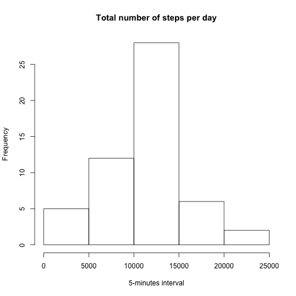
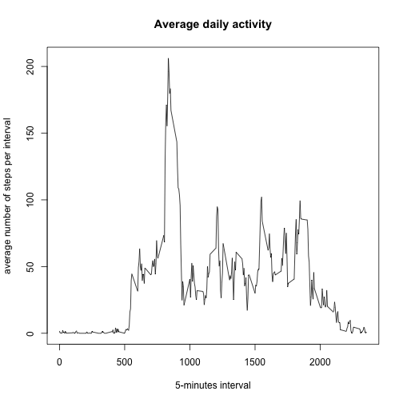
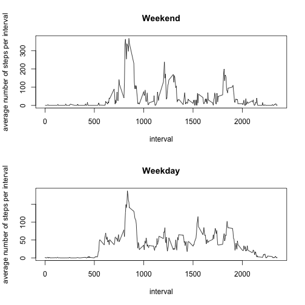

Reproducible research, peer assignment 1
cretaed by Alexa Kiss
======================
title: "Peer1"
output: html_document

contains separate chuncks for each subtask

## Read in and summarize dataset


```r
activity <- read.csv("~/datasci_course_materials/Reproducible_research/activity.csv")
summary(activity)
```

```
##      steps              date          interval     
##  Min.   :  0.00   10/1/12 :  288   Min.   :   0.0  
##  1st Qu.:  0.00   10/10/12:  288   1st Qu.: 588.8  
##  Median :  0.00   10/11/12:  288   Median :1177.5  
##  Mean   : 37.38   10/12/12:  288   Mean   :1177.5  
##  3rd Qu.: 12.00   10/13/12:  288   3rd Qu.:1766.2  
##  Max.   :806.00   10/14/12:  288   Max.   :2355.0  
##  NA's   :2304     (Other) :15840
```

## Ignoring missing values


```r
activity2<-na.omit(activity)
```

## Calculating and plotting the sum of steps per day


```r
stepsum=NULL
D<-length(unique(activity2$date))
datecounter<-unique(activity2$date)

for (i in 1:D)
{ 
    daydate<-subset(activity2, date ==datecounter[i])
    stepsum[i]<-sum(daydate$step)
}
hist(stepsum, main="Total number of steps per day", xlab="5-minutes interval")
```

 

## mean and median of total steps


```r
mean(stepsum)
```

```
## [1] 10766.19
```

```r
median(stepsum)
```

```
## [1] 10765
```

## daily activity pattern and missing value imput


```r
step_avr<-tapply(activity2$steps,activity2$interval,mean,simplify=TRUE)

active<-plot(unique(activity2$interval),step_avr,type="l",main="Average daily activity",xlab="5-minutes interval",ylab="average number of steps per interval")
```

 

```r
## finding the interval of maximum activity
which.max(step_avr)
```

```
## 835 
## 104
```

```r
## calculate and input missing values

## number of missing values
sum(is.na(activity))
```

```
## [1] 2304
```

```r
## the imputting step

## locate missing data points
missing<-which(is.na(activity$steps))

## which time interval they are missing from
interv<-activity$interval[missing]

## converting numeric vector into vector for easier manipulation
trial<-as.vector(step_avr)

## creating new dataset

imputted<-activity

averagestep<-cbind(unique(activity2$interval),trial)
#imputted$steps[missing]<-averagestep$V1==interv
```

#### inputting part didnt work out, i couldnt cope with the element selection of numeric vector "step_avr" :((

both the mean and median values are different after imputting. this i know from experience from other languages

#### so i need to stick to the dataset without missing values

## select weekdays and weekends and plot


```r
Try<-weekdays(as.Date(activity2$date))

activity2$day<-vector(length=length(Try))

for (k in 1:(length(Try)))
    {            
# apparently, date is not in an unambigous format, therefore less elements are contained.
# for now i replace na-s with weekday. I know, this introduces a bias, but still smaller
# than "weekend" would :)

    if (is.na(Try[k]==TRUE))
         {
            activity2$day[k]="weekday"
                
            }

    
    
        else if (Try[k]=="Saturday" || Try[k]=="Sunday")
        
        {
            activity2$day[k]="weekend"
            }
            

        else
            
            {
            activity2$day[k]="weekday"
                
            }
        }

activity2$day<-as.factor(activity2$day)

weekday<-subset(activity2,activity2$day=="weekday")

weekdaystep<-tapply(weekday$steps,weekday$interval,mean)


weekend<-subset(activity2,activity2$day=="weekend")

weekendstep<-tapply(weekend$steps,weekend$interval,mean)

par(mfrow=c(2,1)) 

plot(unique(weekend$interval),weekendstep,type="l",main="Weekend",xlab="interval",ylab="average number of steps per interval")

plot(unique(weekday$interval),weekdaystep,type="l",main="Weekday",xlab="interval",ylab="average number of steps per interval")
```

 

#### apparently, date is not in an unambigous format, therefore less elements are contained. i am aware of the existence of the "Lubridate", but cannot dwell into the details for now. The code works at least. :)


